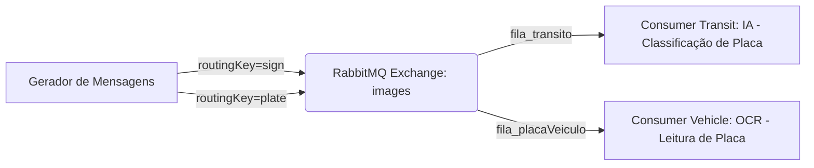

# ⚡ Sistema Distribuído com RabbitMQ, Java e IA

Este projeto implementa um **sistema distribuído em containers Docker** que utiliza **RabbitMQ como broker de mensagens** e dois consumidores com inteligência artificial embarcada.  

O sistema gera uma carga constante de mensagens (imagens de **placas de trânsito** e **placas de veículos**), roteia via RabbitMQ e processa em dois serviços consumidores distintos.  

---

## 🎥 Demonstração

👉 [Assista no YouTube](https://youtu.be/6OCJDhu0gUk)

---

## 📦 Arquitetura do Sistema

O sistema possui **4 containers**:

1. **Gerador de Mensagens (Message Generator)**  
   - Gera mensagens rápidas (~10 mensagens/segundo).  
   - Tipos de mensagens:  
     - **Placas de trânsito** (lombadas, rotatórias, etc.).  
     - **Placas de veículos** (carros, motos, caminhões).  
   - Publica mensagens no **Exchange `images`** do RabbitMQ com routing keys:
     - `sign` → placas de trânsito.  
     - `plate` → placas de veículos.  

2. **RabbitMQ**  
   - Atua como **broker de mensagens**.  
   - Usa **Topic Exchange** para rotear mensagens para os consumidores corretos.  
   - Cada consumidor recebe somente os tipos de mensagens que precisa processar.  

3. **Consumidor 1 (Consumer Transit)**  
   - Recebe mensagens de placas de trânsito.  
   - Processa com IA (classificação de sinalização usando **Smile**).  
   - Identifica o tipo de placa de trânsito (lombada, rotatória, etc.).  

4. **Consumidor 2 (Consumer Vehicle)**  
   - Recebe mensagens de placas de veículos.  
   - Processa com **OCR (Tesseract)** para extrair o texto da placa.  
   - Classifica o tipo de veículo (Carro, Moto, Caminhão) e exibe a placa detectada.  

---

## 🗂️ Estrutura do Projeto

```
.
├── Dataset_transit/      # Imagens de placas de trânsito (lombada, rotatória, etc.)
├── Dataset_plates/       # Imagens de placas de veículos
├── consumerTransit/      # Consumer de placas de trânsito (IA com Smile)
├── consumerVehicle/      # Consumer de placas de veículos (OCR com Tesseract)
├── messageGenerator/     # Gerador de mensagens (envia imagens ao RabbitMQ)
└── docker-compose.yml    # Orquestração de todos os containers
```

---

## 🚀 Como Executar — Passo a Passo

### 1️⃣ Pré-requisitos

Certifique-se de ter instalado:

- [Docker](https://www.docker.com/) (versão 20+ recomendada)  
- [Docker Compose](https://docs.docker.com/compose/) (geralmente já incluso no Docker Desktop)  

Verifique a instalação com:
```bash
docker --version
docker compose version
```

### 2️⃣ Clonar o repositório

```bash
git clone https://github.com/mar-ctrl-z/Sistema-de-Carga-com-IA-embutida-nos-Consumidores-Containers-e-RabbitMQ.git
cd Sistema-de-Carga-com-IA-embutida-nos-Consumidores-Containers-e-RabbitMQ
```

### 3️⃣ Subir todos os containers

Este comando faz o **build** das imagens Docker e inicia todos os 4 containers:

```bash
docker-compose up --build
```

> **💡 Dica:** Na primeira execução, o build pode demorar alguns minutos (download de dependências Maven, Tesseract, etc.). Nas execuções seguintes será muito mais rápido por conta do cache.

Você verá os logs de todos os containers no terminal. Aguarde até ver mensagens como:
```
rabbitmq           | ... completed with 4 plugins.
message-generator  | Imagem: lombada.png | Tipo: Transito | Timestamp: ...
consumer-transit   | Consumidor Transit pronto, aguardando mensagens...
consumer-vehicle   | Consumidor Vehicle pronto, aguardando mensagens...
```

### 4️⃣ Executar em segundo plano (opcional)

Se preferir rodar em background sem travar o terminal:

```bash
docker-compose up --build -d
```

Para acompanhar os logs depois:
```bash
docker-compose logs -f
```

### 5️⃣ Parar todos os containers

```bash
docker-compose down
```

> **⚠️ Caso encontre erros de "precondition_failed"** ao reiniciar, limpe o volume do RabbitMQ antes de subir novamente:
> ```bash
> docker-compose down -v
> docker-compose up --build
> ```

---

## 👀 Como Visualizar o Sistema

### 📟 Logs no Terminal

Ao rodar `docker-compose up --build`, os logs de **todos os containers** aparecem juntos no terminal, coloridos por serviço:

| Prefixo no log | Serviço | O que mostra |
|---|---|---|
| `message-generator` | Gerador | Cada imagem enviada, tipo (Transito/Veiculo) e timestamp |
| `consumer-transit` | Consumer Transit | Arquivo recebido e placa de trânsito detectada pela IA |
| `consumer-vehicle` | Consumer Vehicle | Arquivo recebido, tipo de veículo e texto da placa (OCR) |
| `rabbitmq` | RabbitMQ | Conexões, exchanges e status do broker |

Para ver os logs de **um container específico**:
```bash
# Apenas o gerador de mensagens
docker-compose logs -f message-generator

# Apenas o consumer de trânsito
docker-compose logs -f consumer-transit

# Apenas o consumer de veículos
docker-compose logs -f consumer-vehicle
```

### 🖥️ Painel do RabbitMQ (Management UI)

O RabbitMQ possui um **painel web** para visualizar filas, exchanges e mensagens em tempo real:

1. Acesse no navegador: **http://localhost:15672**
2. Faça login com:
   - **Usuário:** `guest`  
   - **Senha:** `guest`
3. Navegue pelas abas:
   - **Overview** — visão geral do broker (mensagens/segundo, conexões ativas)
   - **Queues** — veja as filas `fila_transito` e `fila_placaVeiculo` com contagem de mensagens
   - **Exchanges** — veja o exchange `images` (tipo Topic)
   - **Connections** — veja os 3 clientes conectados (generator + 2 consumers)

### 📊 Verificar status dos containers

```bash
# Ver containers rodando
docker-compose ps

# Ver uso de recursos (CPU, memória)
docker stats
```

---

## ⚙️ Tecnologias Utilizadas

- **Java 17**  
- **RabbitMQ 3.11** (mensageria distribuída)  
- **Docker + Docker Compose** (containerização e orquestração)  
- **Smile** (biblioteca de Machine Learning em Java — usada no Consumer Transit)  
- **Tesseract OCR** (reconhecimento de caracteres — usado no Consumer Vehicle)  

---

## 📊 Fluxo de Mensagens



---

## 🤖 Exemplos de Saída

### Gerador de Mensagens
```
Imagem: lombada.png | Tipo: Transito | Timestamp: 1778193091636
Imagem: placa3.png | Tipo: Veiculo | Timestamp: 1778193091938
```

### Consumer Transit
```
[Arquivo] rotatoria.png | [Placa Transito Detectada] Rotatória
```

### Consumer Vehicle
```
[Arquivo] placa5.png | [Tipo] Carro | [Placa Detectada] MERCOSUL BRASIL ...
```
